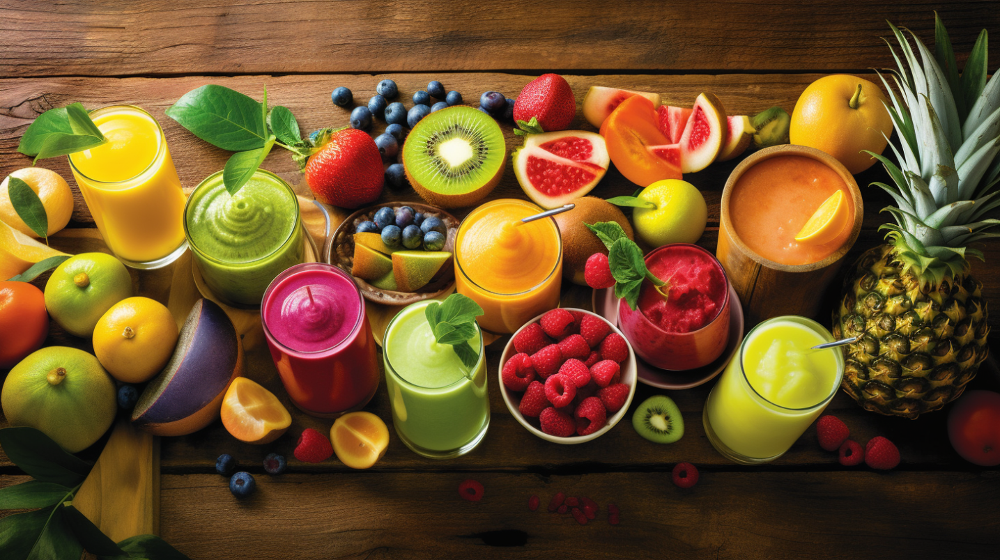

## 🍽 Tasty Bytes Recipe Popularity Prediction Project🍴

📌 Overview
Welcome to the Tasty Bytes Recipe Popularity Prediction project! Our main objective is to predict recipes that will boost our website's traffic and ensure that these selections are correct 80% of the time. Dive into the task, understand the company's context, and get started!

🏢 Background
Founded in 2020, Tasty Bytes emerged during the Covid Pandemic as a beacon for food enthusiasts. Initially introduced as a recipe search engine, it later transitioned into a comprehensive culinary platform offering tailored meal plans. With the right recipe displayed on the homepage, we've seen traffic boosts of up to 40%, leading to higher subscription rates. Your role? Use data science magic to predict these traffic-boosting recipes!

🎯 Challenge
Predict recipes that lead to high traffic.
Aim for 80% accuracy in these predictions.
Craft and showcase a presentation with your findings and recommendations for the product team.
Compile a detailed report capturing your analytical journey, including the code, thought process, and decision-making narrative.

💻 Technology Stack 💻
Here are the primary libraries and tools we're using for this project:

Python
Pandas
NumPy
Scikit-Learn
Matplotlib

## Authors ✍

Stephanie Gessler: https://github.com/steguess

<!-- ALL-CONTRIBUTORS-LIST:START - Do not remove or modify this section -->
<!-- prettier-ignore-start -->
<!-- markdownlint-disable -->
<table>
  <tr>

    <td align="center"><a href="https://github.com/steguess"> <b>Stephanie Gessler</b></a> <a href="https://github.com/codesandbox/codesandbox-client/commits?author=steguess" title="Frontend Developer">💻</a></td>
</table>

<!-- markdownlint-enable -->
<!-- prettier-ignore-end -->
